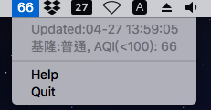

# air-quality-app
**It's a simple app.**

It works on MacOS **>=v10.13**.

MacOS app for monitor Taiwan air quality.



## Requirement
  * Python == 3.6, 3.7
  * [rumps](https://github.com/jaredks/rumps) >= 0.3.0
  * [requests](https://github.com/requests/requests) >= 2.21.0

## Run app
```bash
$ python air_app.py
```

Recommended use [PM2](https://github.com/Unitech/PM2) for work on background.

```bash
$ pm2 start air_app.py --name my_example_app

# If you use pm2 to manage this application.
# "Quit" doesn't work because pm2 will auto restart your application.
# You could use pm2 command. ex.
$ pm2 stop my_example_app
```

## If you use virtual environment
You have to active Python framework (it's virtual environment issue).
  * https://github.com/pyenv/pyenv/issues/1095
  * https://github.com/pypa/pipenv/issues/1416
  * https://github.com/jaredks/rumps/issues/84

```bash
# pyenv
$ CFLAGS="-I$(xcrun --show-sdk-path)/usr/include" \
    PYTHON_CONFIGURE_OPTS="--enable-unicode=ucs2 --enable-framework" \
    pyenv install -v 3.7.3

$ python -V
3.7.3
$ pip install -r requirements.txt
$ python air_app.py
```

## License
MIT license.
