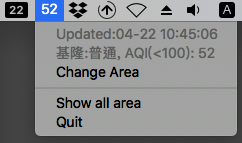

# air-quality-app
**It's a simple app.**

It works on MacOS **v10.13.X**.

MacOS app for monitor Taiwan air quality.



## Requirement
  * Python == 3.6, 3.7
  * [rumps](https://github.com/jaredks/rumps) == 0.2.2
  * [requests](https://github.com/requests/requests) >= 2.20.0

## Run app
```bash
$ python air_app.py
```

Recommended use [PM2](https://github.com/Unitech/PM2) for work on background.

```bash
$ pm2 start air_app.py --name my_example_app

# If you use pm2 to manage this application.
# "Quit" doesn't work because pm2 will auto restart your application.
# You could use pm2 command. ex.
$ pm2 stop my_example_app
```

## License
MIT license.
